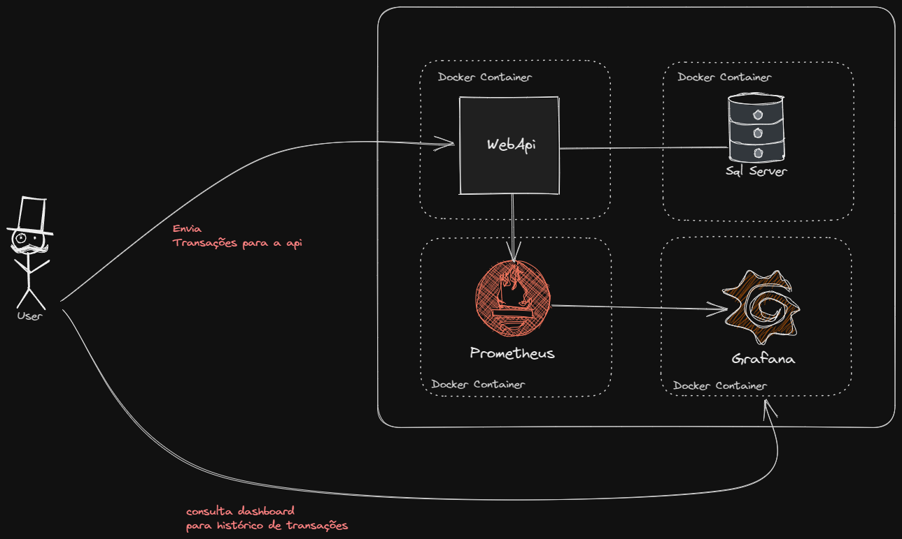

# Controle de Fluxo de Caixa

## Como Utilizar a aplicação

Toda a aplicação está em container. Para realizar a instalação da aplicação use [Docker](https://www.docker.com/) e digite dentro da pasta raiz do projeto onde está o arquivo **docker-compose.yml** o seguinte comando:

> docker compose up

> A aplicação terá a interface do swagger, onde você pode mandar as requisições de operações. Acessível na url: localhost

> Para os relatorios você pode acessar pelo grafana na url: localhost:3000 ou consumir o endpoint no swagger

## Tecnologias envolvidas

- .NET 7
- SQL Server
- Kafka
- Prometheus
- Grafana

## Considerações

Lorem Ipsum is simply dummy text of the printing and typesetting industry. Lorem Ipsum has been the industry's standard dummy text ever since the 1500s.

- Em um primeiro momento essa aplicação rodando em ambiente **on-premise**. Porém com alguns ajustes na camada de infra é possível se tornar um cloud-based system.

## Desenho

